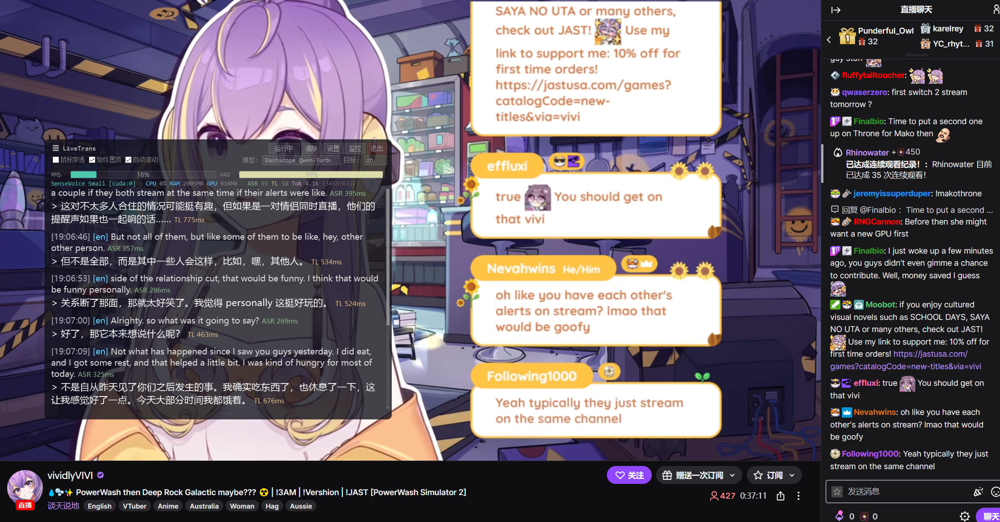
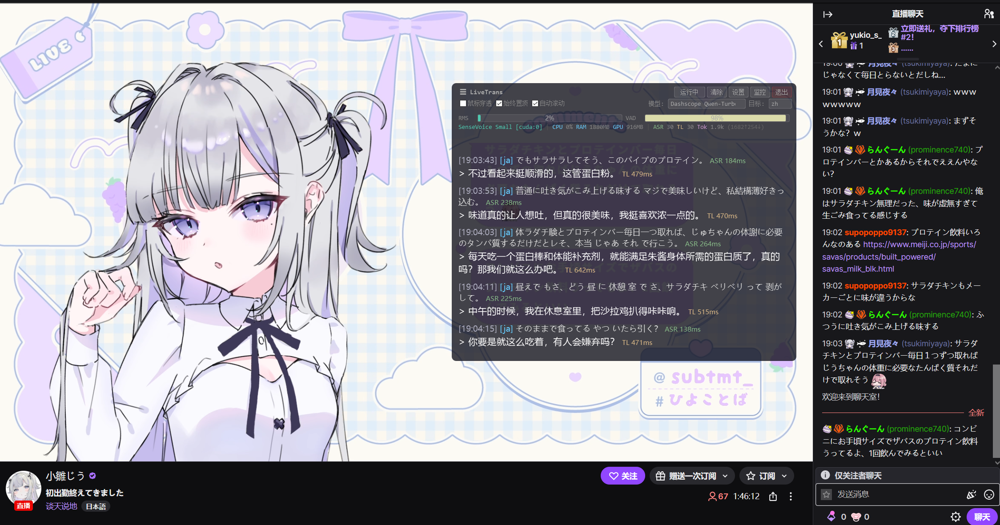

# LiveTrans

[English](README.md) | **中文**

Windows 实时音频翻译工具。捕获系统音频（WASAPI loopback），通过语音识别（ASR）转为文字，再调用 LLM API 翻译，结果显示在透明悬浮字幕窗口上。

适用于看外语视频、直播、会议等场景——无需修改播放器，全局音频捕获即开即用。


## 功能特性

- **实时翻译**：系统音频 → 语音识别 → LLM 翻译 → 字幕显示，全流程自动
- **多 ASR 引擎**：支持 faster-whisper、FunASR SenseVoice（日语优化）、FunASR Nano、Qwen3-ASR（GGUF）
- **灵活的翻译后端**：兼容所有 OpenAI 格式 API（DeepSeek、Grok、Qwen、GPT 等）
- **低延迟 VAD**：32ms 音频块 + Silero VAD，自适应静音检测
- **透明悬浮窗**：始终置顶、鼠标穿透、可拖拽，不影响正常操作
- **支持 CUDA 加速**：ASR 模型可使用 GPU 推理
- **模型自动管理**：首次启动引导下载，支持 ModelScope / HuggingFace 双源
- **翻译基准测试**：内置 benchmark 工具，方便对比不同模型效果

## 截图

**英语 → 中文**（Twitch 直播）



**日语 → 中文**（日语直播）



## 系统要求

- **操作系统**：Windows 10/11
- **Python**：3.10+
- **GPU**（推荐）：NVIDIA 显卡 + CUDA 12.6（用于 ASR 加速）
- **网络**：需要访问翻译 API（如 DeepSeek、OpenAI 等）

## 安装

### 1. 克隆仓库

```bash
git clone https://github.com/TheDeathDragon/LiveTranslate.git
cd LiveTranslate
```

### 2. 创建虚拟环境

```bash
python -m venv .venv
.venv\Scripts\activate
```

### 3. 安装 PyTorch（CUDA 版）

根据你的 CUDA 版本选择安装命令，参考 [PyTorch 官网](https://pytorch.org/get-started/locally/)：

```bash
# CUDA 12.6（推荐）
pip install torch torchaudio --index-url https://download.pytorch.org/whl/cu126

# 仅 CPU（无 NVIDIA 显卡）
pip install torch torchaudio --index-url https://download.pytorch.org/whl/cpu
```

### 4. 安装其余依赖

```bash
pip install -r requirements.txt
pip install funasr --no-deps
```

> **注意**：FunASR 使用 `--no-deps` 安装，因为其依赖 `editdistance` 需要 C++ 编译器。`requirements.txt` 中已包含纯 Python 替代品 `editdistance-s`。

### 5. 启动

```bash
.venv\Scripts\python.exe main.py
```

或者双击 `start.bat`。

## 首次使用

1. **首次启动**会弹出设置向导，选择模型下载源（ModelScope 适合国内，HuggingFace 适合海外）和模型缓存路径
2. 自动下载 Silero VAD 和 SenseVoice ASR 模型（约 1GB）
3. 下载完成后自动进入主界面

## 配置翻译 API

在悬浮窗点击 **设置** → **翻译** 标签页，配置你的翻译 API：

| 参数 | 说明 |
|------|------|
| API Base | API 地址，如 `https://api.deepseek.com/v1` |
| API Key | 你的 API 密钥 |
| Model | 模型名，如 `deepseek-chat` |
| 代理 | `none`（直连）/ `system`（系统代理）/ 自定义代理地址 |

支持任何 OpenAI 兼容 API，包括但不限于：
- [DeepSeek](https://platform.deepseek.com/)
- [xAI Grok](https://console.x.ai/)
- [阿里云 Qwen](https://dashscope.aliyuncs.com/)
- [OpenAI GPT](https://platform.openai.com/)
- 本地部署的 [Ollama](https://ollama.ai/)、[vLLM](https://github.com/vllm-project/vllm) 等

## 使用方法

1. 播放含外语音频的视频/直播
2. 启动 LiveTrans，悬浮窗自动出现
3. 实时显示识别文字和翻译结果

### 悬浮窗控件

- **暂停/继续**：暂停或恢复翻译
- **清除**：清空当前字幕
- **鼠标穿透**：开启后鼠标可穿透字幕窗口
- **始终置顶**：保持在最上层
- **自动滚动**：新字幕自动滚动到底部
- **模型切换**：下拉选择不同翻译模型
- **目标语言**：切换翻译目标语言

### 设置面板

通过悬浮窗 **设置** 按钮或系统托盘菜单打开，包含：

- **VAD/ASR**：选择 ASR 引擎、VAD 模式、灵敏度参数
- **翻译**：API 配置、系统提示词、多模型管理
- **Benchmark**：翻译速度和质量基准测试
- **缓存**：模型缓存路径管理

## 架构

```
Audio (WASAPI 32ms) → VAD (Silero) → ASR (Whisper/SenseVoice/Nano/Qwen3) → LLM Translation → Overlay
```

```
main.py                 主入口，管线编排
├── audio_capture.py    WASAPI loopback 音频捕获
├── vad_processor.py    Silero VAD 语音活动检测
├── asr_engine.py       faster-whisper ASR 后端
├── asr_sensevoice.py   FunASR SenseVoice 后端
├── asr_funasr_nano.py  FunASR Nano 后端
├── asr_qwen3.py        Qwen3-ASR 后端 (ONNX + GGUF)
├── qwen_asr_gguf/      Qwen3-ASR 推理引擎
├── translator.py       OpenAI 兼容翻译客户端
├── model_manager.py    模型检测、下载、缓存管理
├── subtitle_overlay.py PyQt6 透明悬浮窗
├── control_panel.py    设置面板 UI
├── dialogs.py          设置向导、模型下载对话框
├── log_window.py       实时日志查看器
├── benchmark.py        翻译基准测试
└── config.yaml         默认配置文件
```

## 已知限制

- 仅支持 Windows（依赖 WASAPI loopback）
- ASR 模型首次加载需要数秒（GPU）到数十秒（CPU）
- 翻译质量取决于所用 LLM API 的能力
- 嘈杂环境或多人同时说话时识别效果下降

## 致谢

- [CapsWriter-Offline](https://github.com/HaujetZhao/CapsWriter-Offline) — Qwen3-ASR 集成架构和热词系统参考
- [Qwen3-ASR-GGUF](https://github.com/HaujetZhao/Qwen3-ASR-GGUF) — Qwen3-ASR 的 ONNX + GGUF 混合推理引擎
- [llama.cpp](https://github.com/ggml-org/llama.cpp) — GGUF 模型推理运行时

## 许可证

[MIT License](LICENSE)
